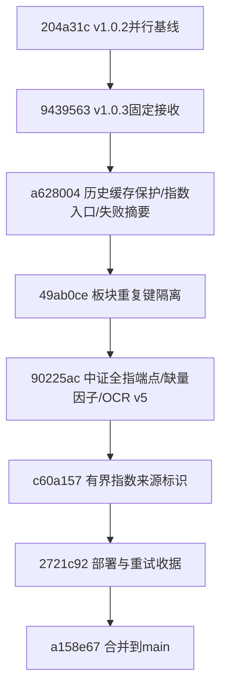
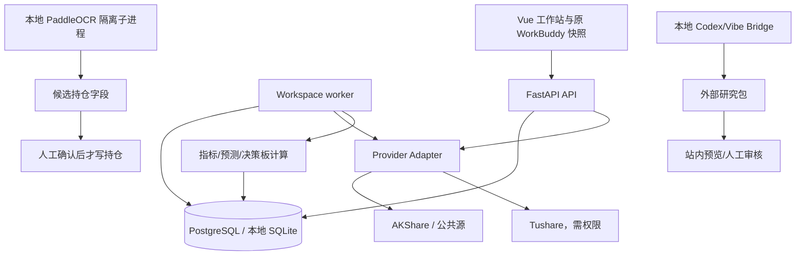

# ETF-Fund-Analysis：项目制造过程与文档地图（v1.0.3）

更新时间：2026-09-09  
当前主线合并提交：`a158e674a1566b14b9dc2383a7b2f6bcd4cde1ad`；知识文档最新提交：`eccacdc1312740d1842c5e20d6ccbeb36be8bfe5`
当前服务器应用提交：`c60a15788d5206a407fc6d8a4238137a9ee19b80`

## 这是什么项目

ETF-Fund-Analysis 是个人使用的中国 ETF/LOF 低频研究工作站。它保存历史行情、技术指标、市场上下文、ETF 决策快照、自选和持仓研究结果，提供人工复盘与只读因子诊断，并允许经过隔离和审核的外部研究包进入站内审核流程。

项目不连接券商、不自动下单，不把模型文字当成确定事实。`actionable=false`、`not_calibrated`、`not_qualified` 是产品中的真实状态，而不是页面装饰。

## 项目是怎样制造出来的

项目采用“需求合同 → 受控实现 → 隔离接收 → 分层验证 → 真实源试跑 → 可回滚部署 → 主线合并”的链路。每一层的证据不能替代另一层。

| 阶段 | 主要输入 | 产物 | 通过条件 |
|---|---|---|---|
| 需求与架构 | 用户需求、`planning/WORKSPACE_PLANNING_V2.md`、现有 API/数据合同 | 页面组织、数据门禁、非目标和回滚边界 | 不破坏 ETF 详情唯一入口、原 WorkBuddy 快照、认证和策略版本 |
| 版本锁定 | 基线 `204a31c`、固定接收 SHA `9439563` | 独立 clone/worktree、接收任务表 | 原工程脏区、外部配置、数据库和账户不被覆盖 |
| 历史与研究修复 | 真实失败复现、单元测试、Provider 合同 | `a628004`、`49ab0ce`、`90225ac`、`c60a157` | 旧完整缓存不被低质量回退覆盖；失败原因可审计；研究诊断不提升信号资格 |
| 本地验收 | Python 3.12、Node、临时 SQLite、隔离浏览器 | 845 个后端通过、5 个条件跳过、前端和 Playwright 收据 | 测试、编译、静态扫描和浏览器证据分别记录 |
| 真实公共源试跑 | AKShare、服务器出口、原持久库副本 | ETF/指数/板块缓存、ProviderAudit | 来源、源日期、数量、失败原因和单位都可追溯；Mock 不得冒充真实数据 |
| 生产部署 | PostgreSQL 备份、旧镜像、当前源代码和 Vue 产物 | `etf-workspace-v101-production`、只读 staging 挂载 | API/worker health、HTTPS、迁移 head、回滚镜像和备份均可验证 |
| 主线合并 | 审核分支和最新 `origin/main` | `a158e67` merge commit | 非强推、无冲突、合并后聚焦回归通过 |

### 版本接力



## 当前系统关系



API、worker 和数据库必须使用同一版本合同。GET 页面只读取缓存；显式任务才访问 Provider。价格历史、技术指标、量价资格、预测校准和 actionable 状态是不同门禁。

## v1.0.3 的关键结果

- 两只 ETF 在服务器重抓后各有 1,196 根日线，时间至 2026-09-08；Sina 源缺成交量，所以只允许价格类指标。
- 上证、沪深300、中证全指各有 1,196 根 OHLC，来源为 `akshare:index:tx-v103`，时间至 2026-09-08。
- 中证全指最初失败的原因不是缺少数据，而是新 Provider 来源标识超过数据库字段长度；修复后先限制来源枚举，再通过批次校验。
- 缺量因子诊断现在可以生成只读研究报告。价格因子可以计算，量价因子保留空覆盖率；报告继续 `qualification=not_qualified`、`actionable=false`，不会改策略。
- 本地 PaddleOCR v5 适配了 `inference.json/yml`、PaddleX 模型名、ndarray 输入和 Windows oneDNN；合成图识别出代码、份额和每份成本。真实持仓图片仍需用户逐项确认。
- Vibe 固定版本的安装和桥接工具检查已完成，但 Windows 上游测试仍受符号链接/路径权限影响；Codex 官方登录、配对和真人模型预算没有自动执行。

## 文档怎么读

| 文档 | 用途 | 事实范围 |
|---|---|---|
| `AGENTS.md` | 安全、数据源、策略和生产操作硬约束 | 当前仓库必须遵守的规则 |
| `STATUS.md` | 当前运行状态、版本、部署和未完成门禁 | 当前状态；历史收据另有归档 |
| `HANDOFF.md` | 新会话接力入口、认证合同、部署边界 | 当前接手说明 |
| `docs/README.md` | 文档总索引 | 先从这里定位专题 |
| `docs/versions/V1.0.3.md` | v1.0.3 代码范围、回滚和未完成项 | 版本合同 |
| `docs/VALIDATION_V103.md` | CI、本机、真实源和模型证据边界 | 验证分类 |
| `docs/LOCAL_ACCEPTANCE_V103.md` | L1–L5 本地接收执行合同 | 逐项验收方法 |
| `docs/LOCAL_ACCEPTANCE_RECEIPT_V103_20260909.md` | 本轮真实入库、部署、回滚、截图和失败项 | 最终净化收据 |
| `docs/HISTORY_STORAGE_V103.md` | 历史缓存、归档、重启和本地电脑边界 | 数据存储合同 |
| `docs/OSS_APPLIED_V103.md` | 外部开源项目如何吸收以及未部署范围 | 开源落点 |
| `docs/ALIYUN_DEPLOYMENT.md` | ECS、Compose、备份、反代和更新 | 通用部署手册 |
| `docs/PROJECT_BUILD_AND_DOCUMENTATION_V103.md` | 本文：制造链路、证据层和文档地图 | 项目知识入口 |
| `docs/PROJECT_KNOWLEDGE_BASE_V103.md` | 深化后的项目知识库总览 | 产品、系统、路线和长期接力 |
| `docs/TECHNICAL_ROUTE_V103.md` | 端到端技术路线 | 请求、任务、缓存、计算、部署 |
| `docs/COMPLETION_AND_EVIDENCE_MATRIX_V103.md` | 完成项与证据矩阵 | 已完成、部分通过、未通过 |
| `docs/OPEN_SOURCE_ADOPTION_REGISTER_V103.md` | 开源借鉴登记册 | revision、许可证、落点与隔离 |
| `docs/archive/pre-v103/` | v1.0.1 及更早时期原文 | 历史，不覆盖当前事实 |

`docs/PRIVATE_REMOTE_DEPLOYMENT.md` 属于本机忽略的运维材料，不应提交、镜像或复制到 Obsidian；`.env`、Token、Cookie、密码、数据库 URI 和原始日志同样不进入知识文档。

## 如何复现当前验收

以下命令只适用于隔离工作目录或测试数据库，不把测试连接到生产库：

```powershell
# 后端全量与编译
\.venv\Scripts\python.exe -m pytest -q
\.venv\Scripts\python.exe -m compileall -q backend/app

# 前端
npm ci --prefix frontend --ignore-scripts
npm run typecheck --prefix frontend
npm run test --prefix frontend
npm run build --prefix frontend

# 临时迁移
alembic upgrade head
alembic check
```

真实 Provider 任务必须从受控任务入口执行，记录返回的 `status`、`requested`、`instruments`、`failures`、源日期和 ProviderAudit。不能用 HTTP 200、目录数量、Mock、缓存存在或模型“已配置”代替真实能力证据。

## 仍然没有通过的门禁

1. Sina 日线成交量缺失，量价因子和 actionable 信号继续阻断。
2. 因子诊断样本目前只有两个 current-contract price-only 标的，统计结果可能为空，不能据此启用因子。
3. OCR 真实图片尚未验收；本地合成图通过不代表用户图片字段正确。
4. Vibe Windows 上游资格测试受环境权限影响；Codex 官方登录、Bridge pairing 和单次真人模型任务需要用户亲自操作。
5. 网站 API Key Secret Store、行情包可信重导入/自动双向同步、月度预测和自动训练仍未实现。

这些缺口写入收据和任务表，不能通过改阈值、填假数据或静默降级来“完成”。
