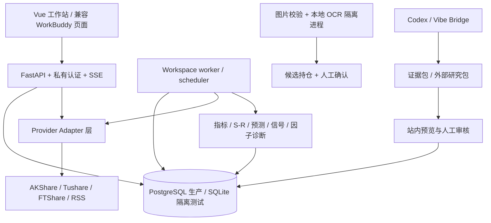

# ETF-Fund-Analysis 项目知识库（v1.0.3）

更新时间：2026-09-09  
知识库用途：把当前代码、验收收据、部署记录、开源调研和未完成门禁组织成可以交接、复盘和继续开发的项目知识。  
当前主线文档提交：`eccacdc1312740d1842c5e20d6ccbeb36be8bfe5`  
服务器当前应用提交：`c60a15788d5206a407fc6d8a4238137a9ee19b80`

## 1. 如何使用这套知识库

这份文档是入口，不是唯一事实源。阅读顺序建议是：

1. 先读本页的项目边界、系统关系和当前完成状态。
2. 再读 [技术路线与工程关系](TECHNICAL_ROUTE_V103.md)，了解请求、任务、缓存、指标、研究包和部署如何串起来。
3. 需要判断“做完没有”时读 [完成项与证据矩阵](COMPLETION_AND_EVIDENCE_MATRIX_V103.md)，不要只看页面是否能打开。
4. 需要引入外部项目时读 [开源借鉴登记册](OPEN_SOURCE_ADOPTION_REGISTER_V103.md)，先看许可证、固定 revision 和隔离边界。
5. 当前运行事实以 `STATUS.md`、`HANDOFF.md` 和最新验收收据为准；本页只保存经过整理的长期知识。

项目记忆必须区分四种内容：

| 内容类型 | 含义 | 可以证明什么 |
|---|---|---|
| 源码事实 | 当前仓库里确实存在的模块、路由、字段和策略合同 | 系统“设计成什么样” |
| 测试事实 | 某个固定提交、隔离数据库或浏览器夹具通过了检查 | 该环境下“这项行为可复现” |
| 真实源事实 | Provider 真实返回、入库、来源和时间戳 | 某个标的/能力“在该次运行可用” |
| 资格结论 | 经过样本外、点时数据、人工批准等门禁后的状态 | 能否升级为生产或 actionable |

HTTP 200、健康检查、Mock、目录数量、模型已安装、缓存存在，都不能单独代替最后一种资格结论。

## 2. 项目是什么，为什么这样做

ETF-Fund-Analysis 是 Jovi 的个人中国 ETF/LOF 低频研究工作站。它把基金目录、历史行情、实时或盘中观察、技术指标、市场上下文、支撑/压力、预测研究、自选、持仓、人工复盘、因子诊断和外部研究包放在同一个证据链里。产品目标是帮助人在交易日研究时间点进行可追溯的判断，而不是替人下单。

系统明确不做以下事情：

- 不连接券商，不保存交易权限，不自动提交订单。
- 不把语言模型输出当成价格、指标、概率、仓位或 current action 的计算器。
- 不把缺失成交量、旧单位、Mock、过期行情或未校准预测包装成实时和可操作数据。
- 不因为页面需要展示而复制 ETF 到指数、用点位填充 OHLC，或用日线下采样冒充分钟线。
- 不因为一次回测好看就自动改阈值、权重、参数或资格状态。

因此产品里出现 `historical_close`、`price_only`、`research_only`、`not_calibrated`、`not_qualified`、`actionable=false`，是数据治理结果，不是未完成的 UI 文案。

## 3. 制造过程：从需求到可回滚主线

项目采用一条可审计的制造链，而不是“改代码后直接部署”：

```text
需求/非目标合同
    ↓
版本与基线锁定
    ↓
独立 worktree 接收
    ↓
失败复现（RED）
    ↓
最小实现与回归（GREEN）
    ↓
固定源/隔离数据库/浏览器验证
    ↓
真实公共源试跑与 Provider 审计
    ↓
备份 + 可回滚部署
    ↓
API / worker / 缓存重启 / 回滚检查
    ↓
净化收据、主线合并、知识库更新
```

本版的版本接力如下：

| 节点 | 作用 | 知识价值 |
|---|---|---|
| `204a31c` | v1.0.2 并行基线 | 说明接收不是从旧 main 随意重建 |
| `9439563` | v1.0.3 固定接收提交 | 固定应用来源和版本合同 |
| `a628004` | 保留完整历史、增加指数入口和失败摘要 | 防止低质量回退覆盖高质量缓存 |
| `49ab0ce` | 板块重复/冲突记录隔离 | 让批次部分失败可审计且不污染其他标的 |
| `90225ac` | 中证全指端点、缺量因子诊断、PaddleOCR v5 适配 | 修复真实接收中的三类能力缺口 |
| `c60a157` | 有界指数来源标识 | 使真实指数来源能通过数据库字段合同 |
| `2721c92` | 部署、重试、生产收据 | 把代码证据与运行证据分开记录 |
| `a158e67` | 审核分支合并到最新主线 | 保留合并关系，不改写历史 |
| `5d8d12a` / `b170010` / `eccacdc` | 项目知识文档、同步记录和最终状态台账 | 让后续会话可以从知识库继续接力 |

制造过程的核心原则是：每个阶段只证明它自己的问题。代码测试不能证明生产 Provider 可用，生产 health 不能证明预测校准，模型安装不能证明真人任务通过。

## 4. 系统全貌



### 4.1 后端层

`backend/app/main.py` 创建 FastAPI 应用、挂载静态资源和 API；`backend/app/api/router.py` 提供认证、健康检查和传统 API；`backend/app/workspace/` 提供 v1.0.3 工作站合同；`backend/app/services/` 保存确定性业务服务；`backend/app/providers/` 是所有外部行情/新闻入口；`backend/app/models/` 是 SQLAlchemy 实体。

服务按职责分层：

- **入口与认证**：`main.py`、`api/router.py`、`core/security.py`、`services/auth_service.py`。生产认证来自数据库账户和 HttpOnly/SameSite Cookie；不能把旧 Bearer 或环境变量账户当成生产认证。
- **行情与目录**：`providers/*`、`services/market_service.py`、`services/market_batch_service.py`、`workspace/data_sources.py`。目录同步、日线、指数 OHLC、实时报价、分钟线和新闻均通过适配器进入。
- **确定性计算**：`indicator_service.py`、`support_resistance_service.py`、`forecast_service.py`、`signal_service.py`、`current_decision_service.py`、`decision_board_service.py`。这些服务不接受模型文字来改写数值。
- **研究与校准**：`factor_analysis_service.py`、`validation_service.py`、`calibration_service.py`、`global_model_research_service.py`、`portfolio_optimization_service.py`。默认是研究或候选状态，人工批准才可能升级。
- **工作站任务**：`workspace/protocol.py` 定义任务和研究结果版本；`workspace/jobs.py` 管理研究任务；`workspace/data_jobs.py` 和 `workspace/worker.py` 管理数据任务、租约、重试和失败状态。
- **持仓和 OCR**：`holding_import_service.py`、`ocr/image_validation.py`、`ocr/paddle_adapter.py`。图片只进入有界临时目录，识别结果先成为候选行，确认前不写 `Holding`。
- **外部研究**：`workspace/external_research.py`、`bridge_api.py`、`review_service.py`。桥接器只传隔离证据包，外部内容标记为不可信研究材料，不直接变成动作。

### 4.2 数据实体

`backend/app/models/entities.py` 的实体大致分为六组：

| 组 | 代表实体 | 用途 |
|---|---|---|
| 身份与租户 | `AuthUser`、`AuthSession`、`AuthBootstrapGuard` | 账户、会话、初始管理员门禁 |
| 市场基础 | `Instrument`、`DailyBar`、`QuoteSnapshot`、`MarketBar` | 标的、日线、报价、分钟/多周期数据 |
| 研究快照 | `IndicatorSnapshot`、`ForecastSnapshot`、`SupportResistanceSnapshot`、`SignalSnapshot` | 把计算结果按版本、时间和来源固化 |
| 决策与上下文 | `DecisionBoardSnapshot`、`DecisionBoardProvisionalInput`、`SectorSnapshot`、`MarketContextSnapshot` | 总览、板块、市场观察和 14:30 研究 |
| 用户私有 | `Holding`、`UserWatchlistEntry`、持仓导入 session/candidate | 成本、份额、自选、OCR 候选；按用户隔离 |
| 审计与任务 | `TaskRun`、`ProviderAudit`、`EventLog`、`ReportArtifact`、`AnalysisRun`、`AgentReviewCandidate` | 任务、源调用、失败分类、报告与人审 |

共享市场快照不能写入用户成本；用户持仓也不能反过来污染公共指标和信号。

### 4.3 前端层

前端位于 `frontend/src/`，使用 Vue 3、Vue Router、Pinia、KLineCharts 9.8.12 和 Lucide 图标。生产镜像在 `backend/Dockerfile` 中先执行 `typecheck` 和 `build`，再将构建后的 `workspace_dist` 交给 Python API 提供。

当前一级路由和职责：

| 路由 | 页面 | 说明 |
|---|---|---|
| `/` | `Overview.vue` | 市场总览、板块、ETF 决策总表 |
| `/analysis` | `Catalog.vue` | 可搜索 ETF/LOF 目录 |
| `/etf/{code}` | `Detail.vue` | 唯一标的详情入口、K 线和研究信息 |
| `/watchlist` | `Watchlist.vue` | 当前用户自选 |
| `/holdings` | `Holdings.vue` | 当前用户持仓、成本和导入 |
| `/factors` | `Factors.vue` | 研究候选因子诊断 |
| `/research/news` | `News.vue` | 新闻事实和分析候选 |
| `/review`、`/history` | `Archive` 相关视图 | 每日复盘和研究档案 |
| `/ai` | `AISetupGuide.vue` | Codex/Vibe/手工研究引导，不打开即调用模型 |
| `/settings`、`/profile` | `Settings.vue` | 数据连接、Bridge、个人设置 |
| `/decision/1430` | 重定向到总览模式 | 兼容旧入口，保持 14:30 研究语义 |

`frontend/src/routerFactory.ts` 保留旧 URL 重定向；`backend/app/static/` 仍有旧 WorkBuddy/legacy 页面，作为回滚和兼容资产，不能因为新 Vue 路由存在就直接删除。

## 5. 技术路线

### 5.1 数据先于模型

技术路线不是“先接大模型再补数据”，而是：

```text
目录/标的身份
  → 真实历史 OHLC(V)
  → 来源、时间、单位和质量校验
  → 确定性指标与支撑压力
  → 预测研究快照（未校准）
  → 资格门禁与 canonical current action
  → 人工复盘 / 外部研究候选
```

缺少上游字段时保留可用的低阶结果。例如成交量为空可以继续展示历史价格和价格类指标，但不能计算量价因子，也不能提升 `actionable`。

### 5.2 Provider Adapter 优先

业务服务不直接写网站私有接口。`MarketProvider` 合同统一日线、分钟线、指数 OHLC、报价和新闻返回；`composite.py` 负责主备公共源和失败记录；`tushare.py`、`akshare.py`、`ftshare.py`、`rss_news.py` 只负责适配字段和来源；`mock.py` 仅用于隔离演示/测试。

生产默认要求 `MARKET_PROVIDER=composite`、`ALLOW_MOCK_FALLBACK=false`。Mock 结果带明确来源和不可操作标记，不能悄悄成为真实数据。

### 5.3 异步任务而不是 GET 抓取

页面 GET 只读缓存和快照。下载、重算、因子诊断、历史指数、分钟线和研究任务都通过有界任务进入 worker；任务持有租约、状态、重试次数、失败分类和摘要。这样可以避免用户刷新页面就触发外部 SDK、重复写库或把网络延迟暴露给浏览器。

### 5.4 预测与信号的证据边界

当前正式研究期限是 `1/3/5/10` 个交易日。`p_up` 在未完成 purged walk-forward、Holdout 和人工批准前，只能解释为历史相似样本上涨占比；未来走廊是研究情景，不能当未来真实 OHLC。`SignalService`、`PreflightService` 和 14:30 服务会检查 freshness、来源、样本数、校准状态和必需字段，缺失时返回研究或不可操作状态。

### 5.5 研究模型和 AI 的位置

AI gateway 接收有版本和 hash 的证据包，只输出结构化事实、推断、风险和冲突；没有 Shell、数据库写入、网络抓取、券商和 current action 权限。Codex/Vibe 外部结果以 `external_unverified` 或 `research_only` 导入，先预览、再人工审核。确定性指标、仓位和动作始终由本项目代码计算。

## 6. 已完成能力

当前主线已经形成可运行产品的主要部分：

1. Vue 工作站、搜索、目录、统一 ETF 详情、自选、持仓、新闻、复盘、因子和连接设置。
2. 数据库认证、Cookie 会话、CSRF、防重放、用户隔离和登录限流合同。
3. ETF 日线、指数真实 OHLC、缓存保护、来源审计、批次失败摘要和重启保留。
4. MA/MACD/KDJ/RSI/TD9、支撑压力、1/3/5/10 研究快照和 canonical current action 的共享读取。
5. 持仓 CSV/XLSX/手工/OCR 候选导入、编辑、拒绝、确认、修订和撤销。
6. 因子诊断、人工复盘、报告、外部研究包预览和有租约的 Bridge 任务。
7. Docker Compose、PostgreSQL、Alembic、API/worker 分离、只读容器、备份和 ECS 部署脚本。
8. 固定提交接收、隔离数据库迁移、前后端测试、浏览器回放、真实公共源试跑和生产回滚材料。

“完成”在这里表示代码路径、数据合同和对应证据存在；不表示所有真实数据、模型、OCR 和未来资格都已经通过。

## 7. 可复用的工程经验

### 7.1 完整缓存优先于低质量回退

当主源返回缺量或不完整字段时，不能直接覆盖已有完整行。先按标的读取现有记录，逐行比较质量和来源，再只接受更高质量或更新日期；同一日期不混拼不同源的字段。这个经验来自固定 SHA 真实试验中 Sina 回退覆盖完整 EM 行的失败。

### 7.2 研究池不是全市场目录

目录同步得到的是可搜索身份集合，不代表每个标的都已经下载历史、注册研究或具备信号资格。页面应显示“可搜索”和“已入研究池”的差别，补齐历史必须是显式任务。

### 7.3 缺失字段要保留，不要猜单位

成交量缺失就保存 `null`，不填零；AKShare 指数量能单位未核定就留空；Tushare 单位只有在适配器合同明确时转换。价格类指标和量价指标分开门禁，避免“看起来有数据”而实际污染回测。

### 7.4 真实源失败时保留旧缓存

任务失败要保留 provider、操作、耗时、记录数和有界原因；失败批次不能清空旧缓存。断网重试的验收标准是“失败可见、旧数据和 hash 不变、恢复网络后可再次尝试”。

### 7.5 迁移、部署、知识库都要有回滚

生产更新先备份数据库和旧镜像，再 `git pull --ff-only`、构建、迁移和健康检查；知识库写入先 DryRun、hash 再 Apply。任何一层发现冲突都停在原状态，不用猜测覆盖。

## 8. 当前未完成的最终路线

按优先级，下一阶段不是继续换皮，而是补足真实证据：

```text
P0 真实 14:30 point-in-time 数据集
  → P1 5m/15m/30m/60m Provider 资格
  → P2 1/3/5/10 预测样本外校准
  → P3 含费用、滑点、停牌、涨跌停的事件回测
  → P4 至少 20 个交易日的 shadow run 和人工复核
```

UI 的页面拆分、持仓与详情融合、更多新闻和图表增强可以并行，但不能以页面完成掩盖 P0–P4 的资格缺口。

当前明确未通过：

- 两只 ETF 的成交量完整性和量价因子资格。
- 因子诊断的充分样本与样本外认证。
- 真实中文持仓图片的 OCR 资格。
- Vibe Windows 上游资格测试。
- 用户本人 Codex 登录、配对和预算内真人模型任务。
- API Key 安全凭据存储、可信行情包导入/双向同步、月度预测和自动训练。

这些事项必须通过独立证据和人工批准完成，不能用填充数据、调整阈值或模型已安装替代。

## 9. 关联文档

- [技术路线与工程关系](TECHNICAL_ROUTE_V103.md)
- [完成项与证据矩阵](COMPLETION_AND_EVIDENCE_MATRIX_V103.md)
- [开源借鉴登记册](OPEN_SOURCE_ADOPTION_REGISTER_V103.md)
- [项目制造过程与文档地图](PROJECT_BUILD_AND_DOCUMENTATION_V103.md)
- [v1.0.3 本地接收收据](LOCAL_ACCEPTANCE_RECEIPT_V103_20260909.md)
- [v1.0.3 开源吸收落点](OSS_APPLIED_V103.md)
- [历史存储合同](HISTORY_STORAGE_V103.md)
- [部署指南](ALIYUN_DEPLOYMENT.md)
